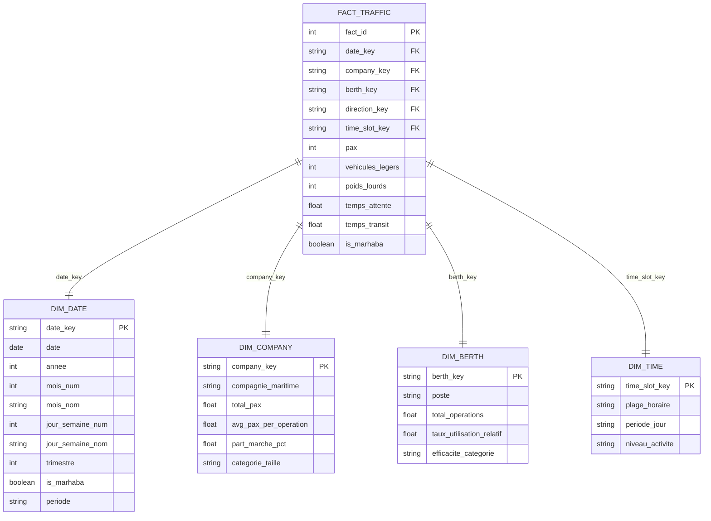

# 📚 Documentation Technique - Analyse Tanger Med

## 🎯 Vue d'Ensemble Technique

Cette documentation détaille l'implémentation technique du projet d'analyse data-driven du trafic Tanger Med pendant la période Marhaba 2022-2023.

## 🏗️ Architecture Logicielle

### Modèle de Données



### Architecture des Modules

```
src/
├── data_preprocessing.py      # Module de prétraitement
│   ├── TangerMedDataProcessor # Classe principale
│   ├── create_sample_data()   # Génération de données test
│   └── Méthodes de nettoyage
├── eda_analysis.py           # Module d'analyse exploratoire
│   ├── TangerMedEDA          # Classe principale
│   ├── Statistiques descriptives
│   └── Visualisations automatisées
├── kpi_analysis.py           # Module KPI
│   ├── TangerMedKPIAnalyzer  # Classe principale
│   ├── KPI UNCTAD standards
│   └── Dashboards KPI
├── statistical_analysis.py   # Module statistique
│   ├── TangerMedStatisticalAnalyzer
│   ├── Tests ANOVA/corrélations
│   └── Tests post-hoc
└── powerbi_dashboard.py      # Module Power BI
    ├── PowerBIDashboardPrep  # Classe principale
    ├── Modèle de données
    └── Génération DAX
```

## 🔧 Spécifications Techniques

### Dépendances Python

```python
# Core data processing
pandas>=1.5.3          # Manipulation de données
numpy>=1.24.3           # Calculs numériques
openpyxl>=3.1.2         # Support Excel

# Visualisation
matplotlib>=3.7.1       # Graphiques de base
seaborn>=0.12.2         # Visualisations statistiques
plotly>=5.14.1          # Graphiques interactifs

# Analyse statistique
scipy>=1.10.1           # Tests statistiques
statsmodels>=0.14.0     # Modèles statistiques avancés
scikit-learn>=1.2.2     # Machine learning (optionnel)

# Environnement
jupyter>=1.0.0          # Notebooks
xlsxwriter>=3.1.0       # Export Excel avancé
```

### Configuration Environnement

```python
# Configuration matplotlib pour français
plt.rcParams['font.size'] = 10
plt.rcParams['axes.titlesize'] = 12
plt.rcParams['figure.titlesize'] = 14

# Configuration pandas
pd.set_option('display.max_columns', None)
pd.set_option('display.width', None)

# Suppression des warnings
warnings.filterwarnings('ignore')
```

## 📊 Spécifications des Modules

### 1. Module `data_preprocessing.py`

#### Classe `TangerMedDataProcessor`

```python
class TangerMedDataProcessor:
    """Processeur principal pour le nettoyage des données Tanger Med"""
    
    def __init__(self):
        self.raw_data = None
        self.cleaned_data = None
        self.data_info = {}
    
    # Méthodes principales
    def load_data(file_path: str, **kwargs) -> pd.DataFrame
    def clean_column_names(df: pd.DataFrame) -> pd.DataFrame
    def handle_missing_values(df: pd.DataFrame, strategy: dict) -> pd.DataFrame
    def handle_duplicates(df: pd.DataFrame, subset: List[str]) -> pd.DataFrame
    def convert_datetime(df: pd.DataFrame, date_column: str) -> pd.DataFrame
    def normalize_categorical(df: pd.DataFrame, columns: List[str]) -> pd.DataFrame
    def detect_outliers(df: pd.DataFrame, method: str) -> pd.DataFrame
    def create_marhaba_flag(df: pd.DataFrame) -> pd.DataFrame
    def full_preprocessing(file_path: str) -> pd.DataFrame
```

#### Stratégies de Nettoyage

```python
# Stratégies par défaut pour les valeurs manquantes
DEFAULT_MISSING_STRATEGIES = {
    'pax': 'zero',
    'vehicules_legers': 'zero',
    'poids_lourds': 'zero',
    'temps_attente': 'median',
    'temps_transit': 'median',
    'compagnie_maritime': 'mode',
    'poste': 'mode',
    'sens': 'mode'
}

# Mapping des colonnes
COLUMN_MAPPING = {
    'Date': 'date',
    'Jour': 'jour',
    'Mois': 'mois',
    'Compagnie maritime': 'compagnie_maritime',
    'Poste': 'poste',
    'Sens': 'sens',
    'PAX': 'pax',
    'Véhicules légers': 'vehicules_legers',
    'Poids lourds': 'poids_lourds',
    'PlageHoraire': 'plage_horaire',
    'Temps d\'attente': 'temps_attente',
    'Temps de transit': 'temps_transit'
}
```

### 2. Module `eda_analysis.py`

#### Classe `TangerMedEDA`

```python
class TangerMedEDA:
    """Analyseur pour l'exploration des données Tanger Med"""
    
    def __init__(self, data: pd.DataFrame):
        self.data = data.copy()
        self.numeric_columns = self._get_numeric_columns()
        self.categorical_columns = self._get_categorical_columns()
        self.date_column = self._get_date_column()
    
    # Méthodes d'analyse
    def generate_descriptive_stats(save_path: str) -> Dict
    def plot_distributions(save_dir: str) -> None
    def plot_categorical_analysis(save_dir: str) -> None
    def plot_time_series(save_dir: str) -> None
    def plot_correlation_heatmap(save_dir: str) -> None
    def plot_company_analysis(save_dir: str) -> None
    def plot_berth_utilization(save_dir: str) -> None
```

#### Types de Visualisations

```python
# Graphiques générés automatiquement
VISUALIZATION_TYPES = {
    'distributions': ['histogram', 'kde', 'box_plot'],
    'categorical': ['bar_chart', 'pie_chart', 'count_plot'],
    'temporal': ['line_chart', 'seasonal_decompose', 'heatmap'],
    'correlation': ['heatmap', 'scatter_matrix'],
    'company': ['bar_chart', 'pie_chart', 'scatter_plot'],
    'berth': ['bar_chart', 'heatmap', 'utilization_gauge']
}
```

### 3. Module `kpi_analysis.py`

#### Classe `TangerMedKPIAnalyzer`

```python
class TangerMedKPIAnalyzer:
    """Analyseur KPI selon standards UNCTAD"""
    
    def __init__(self, data: pd.DataFrame):
        self.data = data.copy()
        self.kpis = {}
    
    # Catégories de KPI
    def calculate_passenger_throughput_kpis() -> Dict
    def calculate_vehicle_throughput_kpis() -> Dict
    def calculate_waiting_time_kpis() -> Dict
    def calculate_transit_time_kpis() -> Dict
    def calculate_berth_utilization_kpis() -> Dict
    def calculate_company_performance_kpis() -> Dict
    def calculate_seasonal_kpis() -> Dict
    def calculate_operational_efficiency_kpis() -> Dict
```

#### KPI Standards UNCTAD

```python
# KPI de performance portuaire selon UNCTAD
UNCTAD_KPI_CATEGORIES = {
    'throughput': [
        'total_passengers', 'avg_passengers_per_day', 'peak_day_passengers',
        'total_vehicles', 'vehicle_passenger_ratio'
    ],
    'efficiency': [
        'average_waiting_time', 'median_waiting_time', 'waiting_time_p95',
        'turnaround_time', 'berth_productivity'
    ],
    'utilization': [
        'berth_utilization_rate', 'time_slot_balance', 'capacity_utilization'
    ],
    'service_quality': [
        'on_time_performance', 'customer_satisfaction_proxy', 'service_reliability'
    ]
}
```

### 4. Module `statistical_analysis.py`

#### Classe `TangerMedStatisticalAnalyzer`

```python
class TangerMedStatisticalAnalyzer:
    """Analyseur statistique avancé"""
    
    def __init__(self, data: pd.DataFrame, significance_level: float = 0.05):
        self.data = data.copy()
        self.alpha = significance_level
        self.results = {}
    
    # Tests statistiques
    def test_normality(columns: List[str]) -> Dict
    def anova_analysis(dependent_vars: List[str], independent_vars: List[str]) -> Dict
    def post_hoc_analysis(dependent_var: str, independent_var: str) -> Dict
    def correlation_analysis(variables: List[str], method: str) -> Dict
    def chi_square_analysis(var1: str, var2: str) -> Dict
    def regression_analysis(dependent_var: str, independent_vars: List[str]) -> Dict
```

#### Tests Statistiques Implémentés

```python
# Tests de normalité
NORMALITY_TESTS = {
    'small_sample': 'shapiro_wilk',  # n <= 5000
    'large_sample': 'kolmogorov_smirnov'  # n > 5000
}

# Tests ANOVA
ANOVA_COMBINATIONS = [
    ('pax', 'compagnie_maritime'),
    ('pax', 'poste'),
    ('pax', 'sens'),
    ('pax', 'is_marhaba'),
    ('temps_attente', 'compagnie_maritime'),
    ('temps_attente', 'poste'),
    ('vehicules_legers', 'jour_semaine'),
    ('poids_lourds', 'plage_horaire')
]

# Interprétation des tailles d'effet
EFFECT_SIZE_INTERPRETATION = {
    'eta_squared': {
        'small': 0.01,
        'medium': 0.06,
        'large': 0.14
    },
    'correlation': {
        'very_weak': 0.1,
        'weak': 0.3,
        'moderate': 0.5,
        'strong': 0.7,
        'very_strong': 0.9
    }
}
```

### 5. Module `powerbi_dashboard.py`

#### Classe `PowerBIDashboardPrep`

```python
class PowerBIDashboardPrep:
    """Préparateur pour dashboard Power BI"""
    
    def __init__(self, data: pd.DataFrame):
        self.data = data.copy()
        self.dashboard_tables = {}
        self.measures = {}
        self.relationships = []
        self.dashboard_structure = {}
    
    # Création du modèle de données
    def create_fact_table() -> pd.DataFrame
    def create_date_dimension() -> pd.DataFrame
    def create_company_dimension() -> pd.DataFrame
    def create_berth_dimension() -> pd.DataFrame
    def create_time_dimension() -> pd.DataFrame
    def create_aggregated_tables() -> Dict[str, pd.DataFrame]
    
    # Génération Power BI
    def create_dax_measures() -> Dict[str, str]
    def define_relationships() -> List[Dict]
    def create_dashboard_structure() -> Dict
```

#### Mesures DAX Principales

```dax
-- Mesures de base
Total Passagers = SUM(fact_traffic[pax])
Total Véhicules = SUM(fact_traffic[vehicules_legers]) + SUM(fact_traffic[poids_lourds])
Temps Attente Moyen = AVERAGE(fact_traffic[temps_attente])

-- Mesures de comparaison temporelle
PAX Année Précédente = CALCULATE([Total Passagers], SAMEPERIODLASTYEAR(dim_date[date]))
Croissance PAX (%) = DIVIDE([Total Passagers] - [PAX Année Précédente], [PAX Année Précédente]) * 100

-- Mesures saisonnières
PAX Marhaba = CALCULATE([Total Passagers], dim_date[is_marhaba] = TRUE)
PAX Hors Marhaba = CALCULATE([Total Passagers], dim_date[is_marhaba] = FALSE)
Augmentation Marhaba (%) = DIVIDE([PAX Marhaba] - [PAX Hors Marhaba], [PAX Hors Marhaba]) * 100

-- Mesures de performance
Part de Marché (%) = DIVIDE([Total Passagers], CALCULATE([Total Passagers], ALL(dim_company))) * 100
Rang Compagnie PAX = RANKX(ALL(dim_company[compagnie_maritime]), [Total Passagers],, DESC)

-- Mesures conditionnelles
Couleur Performance = 
VAR Performance = [Moyenne PAX par Opération]
VAR Benchmark = CALCULATE(AVERAGE(fact_traffic[pax]), ALL())
RETURN
SWITCH(
    TRUE(),
    Performance >= Benchmark * 1.1, "Vert",
    Performance >= Benchmark * 0.9, "Orange",
    "Rouge"
)
```

## 🔍 Algorithmes et Méthodes

### Détection d'Outliers

```python
def detect_outliers_iqr(data: pd.Series, threshold: float = 1.5) -> pd.Series:
    """Détection d'outliers par méthode IQR"""
    Q1 = data.quantile(0.25)
    Q3 = data.quantile(0.75)
    IQR = Q3 - Q1
    lower_bound = Q1 - threshold * IQR
    upper_bound = Q3 + threshold * IQR
    return (data < lower_bound) | (data > upper_bound)

def detect_outliers_zscore(data: pd.Series, threshold: float = 3.0) -> pd.Series:
    """Détection d'outliers par Z-score"""
    z_scores = np.abs((data - data.mean()) / data.std())
    return z_scores > threshold
```

### Calcul des KPI Saisonniers

```python
def calculate_seasonal_intensity(data: pd.DataFrame) -> Dict:
    """Calcul de l'intensité saisonnière"""
    monthly_data = data.groupby([data['date'].dt.month, 'is_marhaba'])['pax'].sum()
    intensity = {}
    
    for month in range(1, 13):
        marhaba_pax = monthly_data.get((month, True), 0)
        normal_pax = monthly_data.get((month, False), 0)
        total_pax = marhaba_pax + normal_pax
        
        if total_pax > 0:
            intensity[month] = (marhaba_pax / total_pax) * 100
        else:
            intensity[month] = 0
    
    return intensity
```

### Tests Statistiques Post-Hoc

```python
def perform_tukey_hsd(data: pd.DataFrame, dependent_var: str, independent_var: str, alpha: float = 0.05):
    """Test de Tukey HSD pour comparaisons multiples"""
    from statsmodels.stats.multicomp import pairwise_tukeyhsd
    
    analysis_data = data[[dependent_var, independent_var]].dropna()
    
    tukey_result = pairwise_tukeyhsd(
        endog=analysis_data[dependent_var],
        groups=analysis_data[independent_var],
        alpha=alpha
    )
    
    return {
        'summary': str(tukey_result.summary()),
        'pairwise_comparisons': extract_pairwise_results(tukey_result),
        'significant_pairs': extract_significant_pairs(tukey_result)
    }
```

## 📊 Structure des Données

### Format des Données d'Entrée

```python
# Structure attendue du dataset
EXPECTED_COLUMNS = {
    'Date': 'datetime64[ns]',           # Date de l'opération
    'Jour': 'object',                   # Nom du jour
    'Mois': 'object',                   # Nom du mois
    'Compagnie maritime': 'object',     # Nom de la compagnie
    'Poste': 'object',                  # Identifiant du poste/quai
    'Sens': 'object',                   # Entrée ou Sortie
    'PAX': 'int64',                     # Nombre de passagers
    'Véhicules légers': 'int64',        # Nombre de véhicules légers
    'Poids lourds': 'int64',            # Nombre de poids lourds
    'PlageHoraire': 'object',           # Créneau horaire
    'Temps d\'attente': 'float64',      # Temps d'attente en minutes
    'Temps de transit': 'float64'       # Temps de transit en minutes
}

# Contraintes de validation
DATA_CONSTRAINTS = {
    'PAX': {'min': 0, 'max': 10000},
    'Véhicules légers': {'min': 0, 'max': 1000},
    'Poids lourds': {'min': 0, 'max': 500},
    'Temps d\'attente': {'min': 0, 'max': 1440},  # Max 24h
    'Temps de transit': {'min': 0, 'max': 1440}
}
```

### Modèle de Données Power BI

```python
# Relations entre tables (cardinalité)
RELATIONSHIPS = [
    {
        'from_table': 'fact_traffic',
        'from_column': 'date_key',
        'to_table': 'dim_date',
        'to_column': 'date_key',
        'cardinality': 'many_to_one',
        'cross_filter': 'single'
    },
    {
        'from_table': 'fact_traffic',
        'from_column': 'company_key',
        'to_table': 'dim_company',
        'to_column': 'company_key',
        'cardinality': 'many_to_one',
        'cross_filter': 'single'
    }
    # ... autres relations
]

# Index recommandés
RECOMMENDED_INDEXES = {
    'fact_traffic': ['date_key', 'company_key', 'berth_key'],
    'dim_date': ['date_key', 'is_marhaba', 'annee'],
    'dim_company': ['company_key', 'compagnie_maritime'],
    'dim_berth': ['berth_key', 'poste']
}
```

## ⚡ Optimisations Performance

### Optimisations Python

```python
# Utilisation de types optimisés
OPTIMIZED_DTYPES = {
    'pax': 'int32',
    'vehicules_legers': 'int16',
    'poids_lourds': 'int16',
    'temps_attente': 'float32',
    'temps_transit': 'float32',
    'compagnie_maritime': 'category',
    'poste': 'category',
    'sens': 'category',
    'plage_horaire': 'category'
}

# Chunking pour gros datasets
def process_large_dataset(file_path: str, chunk_size: int = 10000):
    """Traitement par chunks pour les gros datasets"""
    chunks = pd.read_csv(file_path, chunksize=chunk_size)
    processed_chunks = []
    
    for chunk in chunks:
        processed_chunk = process_chunk(chunk)
        processed_chunks.append(processed_chunk)
    
    return pd.concat(processed_chunks, ignore_index=True)
```

### Optimisations Power BI

```dax
-- Utilisation de variables pour éviter les recalculs
Mesure Optimisée = 
VAR TotalPAX = SUM(fact_traffic[pax])
VAR TotalOperations = COUNT(fact_traffic[fact_id])
RETURN
DIVIDE(TotalPAX, TotalOperations, 0)

-- Filtres optimisés avec KEEPFILTERS
PAX Filtré = 
CALCULATE(
    SUM(fact_traffic[pax]),
    KEEPFILTERS(dim_date[is_marhaba] = TRUE)
)

-- Agrégations pré-calculées pour performance
Utiliser les tables agrégées pour les métriques fréquentes
```

## 🧪 Tests et Validation

### Tests Unitaires

```python
import unittest
from src.data_preprocessing import TangerMedDataProcessor

class TestDataPreprocessing(unittest.TestCase):
    
    def setUp(self):
        self.processor = TangerMedDataProcessor()
        self.sample_data = create_test_data()
    
    def test_column_cleaning(self):
        """Test du nettoyage des noms de colonnes"""
        cleaned = self.processor.clean_column_names(self.sample_data)
        self.assertIn('compagnie_maritime', cleaned.columns)
        self.assertNotIn('Compagnie maritime', cleaned.columns)
    
    def test_missing_values_handling(self):
        """Test de la gestion des valeurs manquantes"""
        data_with_na = self.sample_data.copy()
        data_with_na.loc[0, 'pax'] = np.nan
        
        cleaned = self.processor.handle_missing_values(data_with_na)
        self.assertEqual(cleaned['pax'].isna().sum(), 0)
    
    def test_outlier_detection(self):
        """Test de la détection d'outliers"""
        result = self.processor.detect_outliers(self.sample_data)
        self.assertIn('is_outlier', result.columns)
```

### Validation des Données

```python
def validate_data_quality(data: pd.DataFrame) -> Dict[str, Any]:
    """Validation de la qualité des données"""
    validation_results = {
        'completeness': {},
        'consistency': {},
        'validity': {},
        'uniqueness': {}
    }
    
    # Completeness - taux de complétude
    for col in data.columns:
        completeness = (data[col].notna().sum() / len(data)) * 100
        validation_results['completeness'][col] = completeness
    
    # Consistency - cohérence des types
    for col, expected_type in EXPECTED_COLUMNS.items():
        if col in data.columns:
            actual_type = str(data[col].dtype)
            validation_results['consistency'][col] = actual_type == expected_type
    
    # Validity - respect des contraintes
    for col, constraints in DATA_CONSTRAINTS.items():
        if col in data.columns:
            within_bounds = data[col].between(constraints['min'], constraints['max']).all()
            validation_results['validity'][col] = within_bounds
    
    # Uniqueness - détection de doublons
    duplicate_rate = (data.duplicated().sum() / len(data)) * 100
    validation_results['uniqueness']['duplicate_rate'] = duplicate_rate
    
    return validation_results
```

## 📈 Monitoring et Maintenance

### Métriques de Monitoring

```python
# KPI de qualité des données
DATA_QUALITY_KPI = {
    'completeness_threshold': 95.0,      # % minimum de complétude
    'consistency_threshold': 100.0,      # % minimum de cohérence
    'validity_threshold': 99.0,          # % minimum de validité
    'timeliness_threshold': 24.0,        # Heures max de latence
    'accuracy_threshold': 95.0           # % minimum de précision
}

# Alertes automatiques
def check_data_quality_alerts(validation_results: Dict) -> List[str]:
    """Vérification des seuils de qualité"""
    alerts = []
    
    for col, completeness in validation_results['completeness'].items():
        if completeness < DATA_QUALITY_KPI['completeness_threshold']:
            alerts.append(f"ALERT: Complétude {col}: {completeness:.1f}%")
    
    return alerts
```

### Procédures de Maintenance

```python
# Nettoyage automatique des fichiers temporaires
def cleanup_temp_files(temp_dir: str, max_age_hours: int = 24):
    """Nettoyage des fichiers temporaires"""
    import os
    import time
    
    current_time = time.time()
    
    for filename in os.listdir(temp_dir):
        file_path = os.path.join(temp_dir, filename)
        if os.path.isfile(file_path):
            file_age = current_time - os.path.getmtime(file_path)
            if file_age > (max_age_hours * 3600):
                os.remove(file_path)

# Archivage des données historiques
def archive_old_data(data: pd.DataFrame, archive_path: str, months_to_keep: int = 12):
    """Archivage des données anciennes"""
    cutoff_date = pd.Timestamp.now() - pd.DateOffset(months=months_to_keep)
    
    recent_data = data[data['date'] >= cutoff_date]
    old_data = data[data['date'] < cutoff_date]
    
    if not old_data.empty:
        old_data.to_parquet(f"{archive_path}/archive_{cutoff_date.strftime('%Y%m')}.parquet")
    
    return recent_data
```

## 🔐 Sécurité et Conformité

### Anonymisation des Données

```python
def anonymize_sensitive_data(data: pd.DataFrame) -> pd.DataFrame:
    """Anonymisation des données sensibles"""
    anonymized = data.copy()
    
    # Hash des identifiants sensibles
    if 'vessel_id' in anonymized.columns:
        anonymized['vessel_id'] = anonymized['vessel_id'].apply(
            lambda x: hashlib.sha256(str(x).encode()).hexdigest()[:8]
        )
    
    # Généralisation des données temporelles sensibles
    if 'exact_timestamp' in anonymized.columns:
        anonymized['hour_slot'] = pd.to_datetime(anonymized['exact_timestamp']).dt.hour
        anonymized.drop('exact_timestamp', axis=1, inplace=True)
    
    return anonymized
```

### Audit Trail

```python
class AuditLogger:
    """Logger pour traçabilité des opérations"""
    
    def __init__(self, log_file: str):
        self.log_file = log_file
        
    def log_operation(self, operation: str, user: str, details: Dict):
        """Enregistrement d'une opération"""
        log_entry = {
            'timestamp': datetime.now().isoformat(),
            'operation': operation,
            'user': user,
            'details': details
        }
        
        with open(self.log_file, 'a') as f:
            f.write(json.dumps(log_entry) + '\n')
    
    def log_data_access(self, table: str, filters: Dict, user: str):
        """Enregistrement d'un accès aux données"""
        self.log_operation('DATA_ACCESS', user, {
            'table': table,
            'filters': filters,
            'record_count': 'calculated_after_query'
        })
```

## 🚀 Déploiement Production

### Configuration Production

```python
# Configuration pour environnement de production
PRODUCTION_CONFIG = {
    'data_sources': {
        'primary': 'postgresql://prod_server:5432/tanger_med',
        'backup': 'postgresql://backup_server:5432/tanger_med'
    },
    'performance': {
        'max_memory_gb': 16,
        'max_cpu_cores': 8,
        'chunk_size': 50000,
        'parallel_processing': True
    },
    'monitoring': {
        'enable_metrics': True,
        'metrics_endpoint': 'http://monitoring:9090/metrics',
        'alert_email': 'admin@tangermed.ma'
    },
    'security': {
        'encrypt_data_at_rest': True,
        'enable_audit_log': True,
        'session_timeout_minutes': 30
    }
}
```

### Scripts de Déploiement

```bash
#!/bin/bash
# deploy.sh - Script de déploiement automatisé

echo "🚀 Déploiement Analyse Tanger Med"

# 1. Vérification des prérequis
python -c "import pandas, numpy, matplotlib, seaborn, scipy, statsmodels" || {
    echo "❌ Dépendances manquantes"
    exit 1
}

# 2. Configuration de l'environnement
export PYTHONPATH="${PYTHONPATH}:$(pwd)/src"
mkdir -p logs outputs powerbi data

# 3. Tests de validation
python -m pytest tests/ -v || {
    echo "❌ Tests échoués"
    exit 1
}

# 4. Déploiement des modules
cp src/*.py /opt/tanger_med_analysis/src/
cp notebooks/main_analysis.py /opt/tanger_med_analysis/

# 5. Configuration des tâches cron
echo "0 6 * * * cd /opt/tanger_med_analysis && python notebooks/main_analysis.py" | crontab -

# 6. Démarrage des services
systemctl start tanger_med_dashboard
systemctl enable tanger_med_dashboard

echo "✅ Déploiement terminé"
```

---

Cette documentation technique fournit tous les détails nécessaires pour comprendre, maintenir et étendre le système d'analyse Tanger Med. Elle couvre l'architecture, les algorithmes, les optimisations, et les procédures opérationnelles pour un déploiement production réussi.